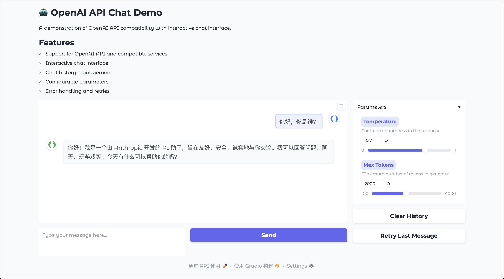

# OpenAI API 兼容性演示项目

[English](README.md) | [中文](README_zh.md)

> 作者：tj-scripts
> 邮箱：tangj1984@gmail.com
> 日期：2024-03-21

一个展示如何构建与 OpenAI API 规范兼容的应用程序的演示项目，支持原生 OpenAI API 和兼容的 API 服务。

## ✨ 特性

- 支持 OpenAI API 和兼容的 API 服务
- 异步 API 调用
- 交互式聊天界面
- 聊天历史管理
- 可配置的日志系统
- 类型提示和文档
- 错误处理和重试机制

## 🚀 安装

1. 克隆仓库：
```bash
git clone https://github.com/yourusername/openai_compatiable_demo.git
cd openai_compatiable_demo
```

2. 使用 uv 创建并激活 Python 虚拟环境：
```bash
# 创建虚拟环境
uv venv .venv --python=3.12

# 激活虚拟环境
# Unix/macOS 系统：
source .venv/bin/activate
# Windows 系统：
.venv\Scripts\activate
```

3. 安装依赖：
```bash
# 首先安装构建工具
uv pip install hatchling

# 以可编辑模式安装包
uv pip install -e .
```

如果安装过程中遇到问题，请确保：
- 已安装 Python 3.12 或更高版本
- uv 已正确安装并添加到系统路径
- 在运行安装命令前已激活虚拟环境

## ⚙️ 配置

1. 复制示例配置文件：
```bash
cp config.toml.example config.toml
```

2. 编辑 `config.toml` 设置 API 配置：
```toml
[api.openai]
api_key = "your-openai-api-key"
base_url = "https://api.openai.com/v1"
model = "gpt-3.5-turbo"
temperature = 0.7
max_tokens = 2000
timeout = 30
stream = false
retry_count = 3
retry_delay = 1

[logging]
level = "INFO"
format = "%(asctime)s - %(name)s - %(levelname)s - %(message)s"
file = "app.log"
max_size = 10485760  # 10MB
backup_count = 5
```

### 📝 配置说明

#### 🔑 API 配置
- `api_key`：您的 OpenAI API 密钥
- `base_url`：API 端点 URL
- `model`：使用的模型名称
- `temperature`：控制随机性（0.0 到 1.0）
- `max_tokens`：生成的最大令牌数
- `timeout`：请求超时时间（秒）
- `stream`：启用流式响应
- `retry_count`：请求失败重试次数
- `retry_delay`：重试延迟时间（秒）

#### 📊 日志配置
- `level`：日志级别（DEBUG、INFO、WARNING、ERROR、CRITICAL）
- `format`：日志消息格式
- `file`：日志文件路径
- `max_size`：日志文件最大大小（字节）
- `backup_count`：保留的日志文件数量

## 💬 使用方法

### Web UI 界面



运行 Web UI 界面：
```bash
python -m tj.scripts.ui
```

Web 界面提供以下功能：
- 交互式聊天界面
- 聊天历史管理
- 可配置参数（温度、最大令牌数）
- 清空历史按钮
- 响应式设计

界面访问地址：
- 本地访问：http://localhost:7860
- 公共 URL：（将在终端中显示）

### 交互式聊天

运行交互式聊天演示：
```bash
python -m tj.scripts.main
```

聊天界面支持以下命令：
- 输入消息并按回车发送
- `history`：显示聊天历史
- `clear`：清空聊天历史
- `help`：显示可用命令
- `quit`：退出聊天
- 按 Ctrl+C 随时退出

聊天会话示例：
```
Welcome to the AI Chat! Type your message and press Enter to chat.
Commands:
  - 'quit': Exit the chat
  - 'clear': Clear chat history
  - 'history': Show chat history
  - 'help': Show this help message

You: 你好，请介绍一下你自己。

Assistant: 你好！我是一个 AI 助手，我可以帮助你回答问题、编写代码、分析数据等...

You: 你能帮我写一个 Python 函数吗？

Assistant: 当然可以！请告诉我你想要实现什么功能...

You: history

=== Chat History ===

System: You are a helpful AI assistant.

User: 你好，请介绍一下你自己。

Assistant: 你好！我是一个 AI 助手，我可以帮助你回答问题、编写代码、分析数据等...

User: 你能帮我写一个 Python 函数吗？

Assistant: 当然可以！请告诉我你想要实现什么功能...

===================

## 🛠️ 开发

1. 确保已安装 Python 3.12 或更高版本
2. 使用虚拟环境进行开发
3. 遵循 PEP 8 编码规范
4. 为所有函数添加类型提示
5. 为所有模块、类和方法编写文档字符串

### 🔧 开发工具

项目在 `pyproject.toml` 中配置了多个开发工具：

- `black`：代码格式化
- `isort`：导入排序
- `mypy`：类型检查
- `pytest`：测试框架

安装开发依赖：
```bash
uv pip install -e ".[dev]"
```

## 🤝 贡献指南

1. Fork 本仓库
2. 创建您的特性分支
3. 提交您的更改
4. 推送到分支
5. 创建新的 Pull Request

## 📄 许可证

[MIT 许可证](LICENSE) 